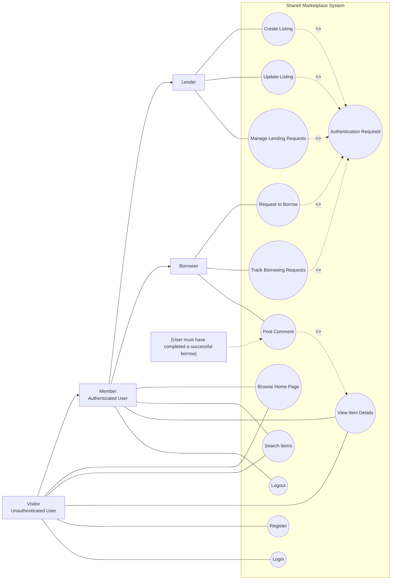
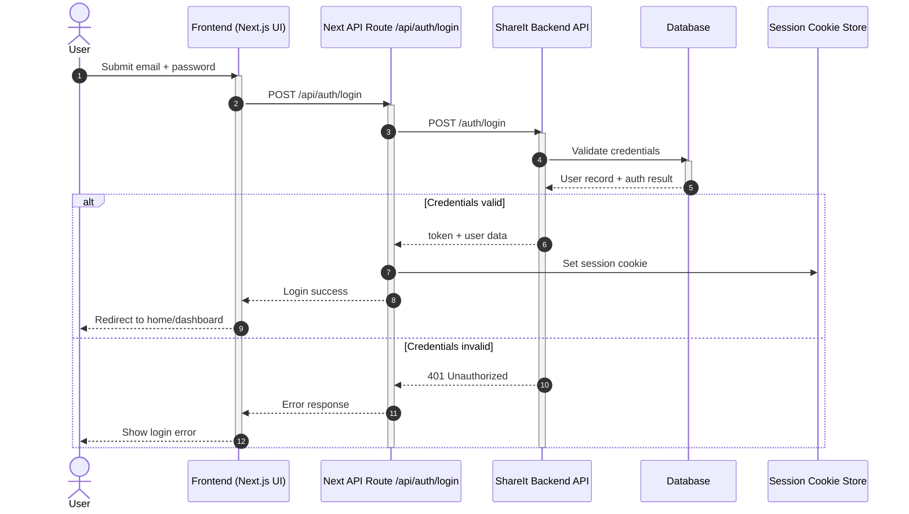
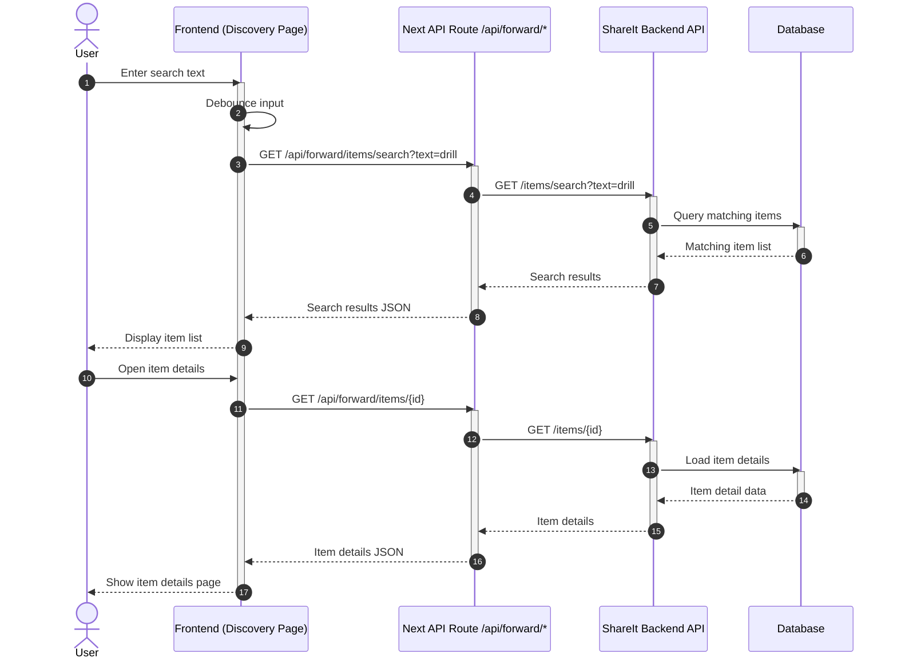
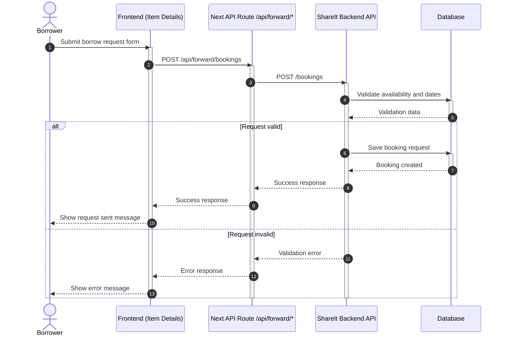

# ShareIt MVP

ShareIt is a Next.js App Router marketplace for temporary item sharing. People can discover useful listings, borrow what they need for a short time, and publish their own unused items for others.

## Features

- secure authentication with register, login, logout, and server-managed session cookies
- public home page with marketplace-style hero, featured listings, and clear borrow/share calls to action
- item discovery with search, availability states, and public item detail pages
- personal listings dashboard for creating and updating shared items
- borrowing dashboard for tracking requests you sent
- lending dashboard for reviewing and managing requests on your own listings
- comments flow for eligible borrowers
- responsive UI built with Next.js App Router, TypeScript, TanStack Query, React Hook Form, and Zod

## Architecture Summary

- `app/` contains thin route entrypoints and the root layout
- `src/views/` owns route-level composition and prefers Server Components
- `src/features/` owns interactive workflows like user selection, create item, create booking, approve/reject booking, filtering, and comments
- `src/entities/` owns DTOs, domain models, mappers, query keys, and API functions
- `src/widgets/` owns composed UI blocks like the app header, item list, booking list, and user list
- `src/shared/` contains cross-cutting UI primitives, config, API client, store, error handling, hooks, and query setup

## Rendering Strategy

- route segments and page shells are Server Components by default
- query-driven content, forms, filters, mutations, and the active-user store are Client Components
- pages are split so only the interactive content becomes client-side when needed

## Environment

Use the real ShareIt backend URL in `.env.local`.

```env
NEXT_PUBLIC_APP_NAME=ShareIt
NEXT_PUBLIC_API_BASE_URL=http://localhost:8080
```

The app falls back to `http://localhost:8080` if `NEXT_PUBLIC_API_BASE_URL` is missing.

## Getting Started

1. Install dependencies:

```bash
npm install
```

2. Copy `.env.example` to `.env.local`

3. Start the app:

```bash
npm run dev
```

4. Open `http://localhost:3000`

## Business Assumptions

- the backend follows the ShareIt-style REST contract used by this frontend:
  - `GET /users`
  - `POST /users`
  - `GET /users/{id}`
  - `PATCH /users/{id}`
  - `DELETE /users/{id}`
  - `GET /items`
  - `GET /items/search?text=&from=&size=`
  - `GET /items/{id}`
  - `POST /items`
  - `PATCH /items/{id}`
  - `POST /bookings`
  - `GET /bookings`
  - `GET /bookings/{id}`
  - `GET /bookings/owner`
  - `PATCH /bookings/{id}?approved=true|false`
  - `POST /items/{id}/comment`
- item details may include `ownerId`, `lastBooking`, `nextBooking`, and `comments`
- booking list endpoints support `state`, `from`, and `size`
- discovery currently requests the first page of search results with `from=0` and `size=20`
- the backend enforces business rules for comment eligibility and invalid booking windows, and returns readable error messages

## Query And State Notes

- TanStack Query owns server data, request status, caching, and invalidation
- Zustand owns only the selected active user ID persisted to localStorage
- query key factories live in entity slices where useful:
  - items use stable keys in `src/entities/item/model/item.query-keys.ts`
  - bookings use stable keys in `src/entities/booking/model/booking.query-keys.ts`
- after mutations, relevant caches are invalidated explicitly instead of relying on implicit refresh

## Minimal Manual Fixes Still Needed

- verify the backend DTO shape matches the assumed ShareIt contract exactly, especially nested booking and comment fields
- confirm the backend exposes `ownerId` on item details if owner-only UI is required
- confirm whether the backend returns a useful body for `DELETE /users/{id}` or always `204 No Content`
- add optional booking detail UI later if `GET /bookings/{id}` needs to be surfaced in the product
- add automated tests once the API contract is stable

## MVP Checklist

- [x] real API client with shared error normalization
- [x] active user persistence and automatic header injection
- [x] real users CRUD and active-user selection flow
- [x] discovery search with debounce and empty-query guard
- [x] owner item management
- [x] item details with comments and booking CTA rules
- [x] borrower and owner booking management pages
- [x] URL-driven booking filter and pagination state
- [x] shared loading, empty, and error states
- [x] consistent app header and navigation
- [x] clear public APIs through `index.ts` files in practical slices

## Use Case Diagram



## Sequence Diagrams

### Login Flow



### Search and View Item Details



### Borrow Request Flow



## Scripts

- `npm run dev`
- `npm run lint`
- `npm run build`
- `npm run start`
